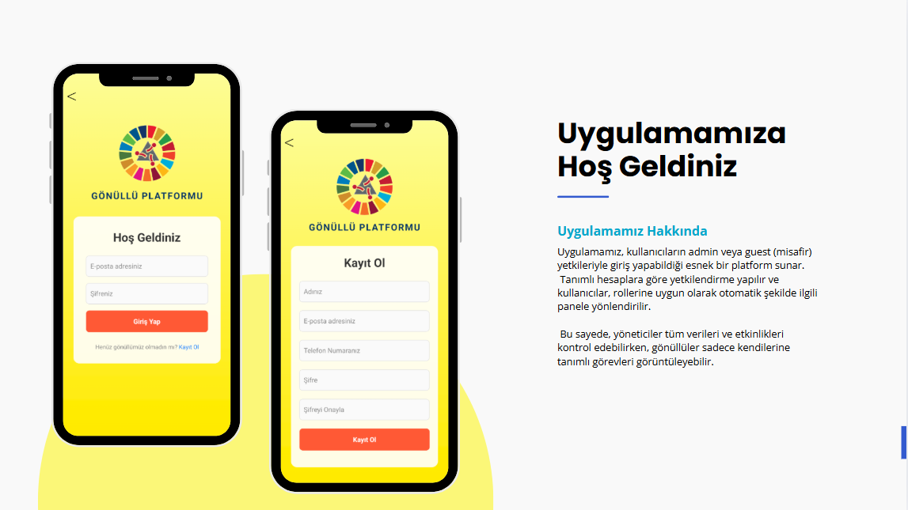
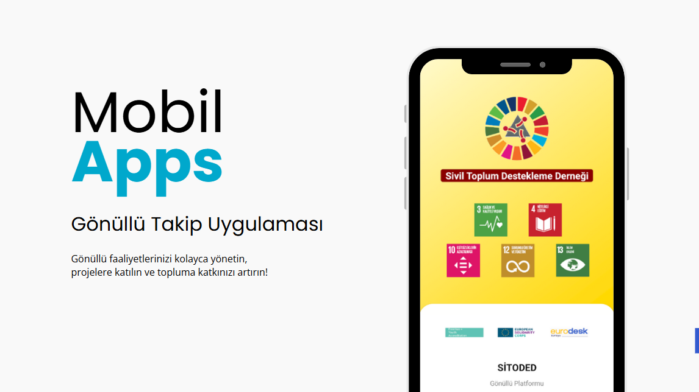
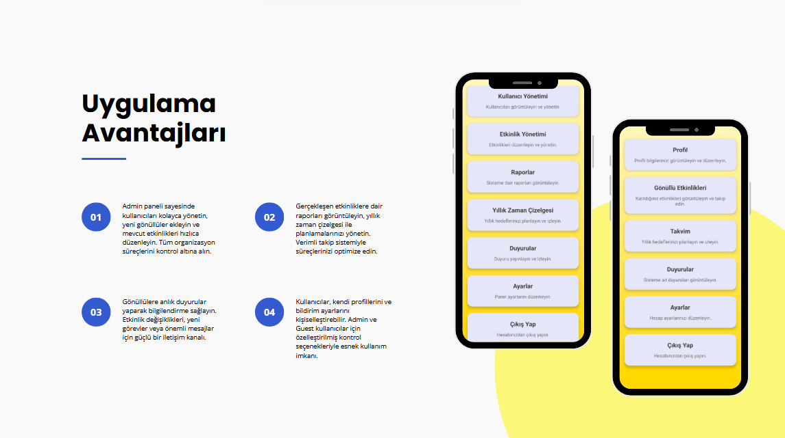
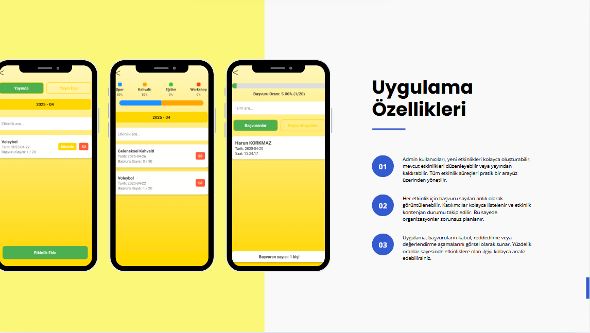
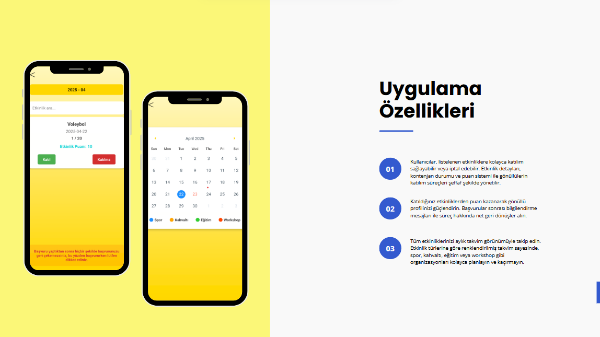

# 🤝 Gönüllü Takip Mobil Uygulaması

**Gönüllü Takip Mobil Uygulaması**, hem **Admin** hem de **Gönüllü (Guest)** kullanıcılar için tasarlanmış, çok panelli bir yönetim sistemine sahip kapsamlı bir mobil uygulamadır. Tek bir uygulama üzerinden yetkilerine göre farklı panellere erişim imkanı sağlar.

---

## 🚀 Özellikler

- **Çift Panel Erişimi:**  
  - **Admin Panel:** Yetkili kullanıcılar, tüm yönetim araçlarına erişebilir.  
  - **Gönüllü Panel (Guest):** Onaylı gönüllüler, kendilerine özel panele giriş yapabilir.
  
- **Kullanıcı Yönetimi:**  
  Kayıtlı kullanıcıları listeleme, düzenleme ve yetkilendirme.

- **Etkinlik Yönetimi:**  
  Etkinlik oluşturma, düzenleme ve gönüllülere atama.

- **Kişi Takip Yönetimi:**  
  Gönüllülerin takip ettiği kişileri ve görevleri yönetme.

- **Duyuru Yönetimi:**  
  Admin tarafından gönüllülere özel duyuruların yayınlanması.

- **Erişim Yönetimi:**  
  Kullanıcı yetkilerini belirleme ve panel erişim kontrolü.

- **Modern ve Kullanıcı Dostu Arayüz:**  
  Basit, anlaşılır ve şık tasarım.

---

## 📸 Uygulama Görselleri

### 🔐 Giriş Ekranı


---

### 🏠 Ana Sayfa


---

### 🛠️ Admin Paneli


---

### 🌟 Özellikler



---

### 🙏 Teşekkürler


---

## ⚙️ Kurulum

Projeyi kendi bilgisayarınızda çalıştırmak için aşağıdaki adımları izleyin:

```bash
git clone https://github.com/kullaniciadi/gonullu-takip-mobil-uygulamasi.git
cd gonullu-takip-mobil-uygulamasi
npm install
npm start
